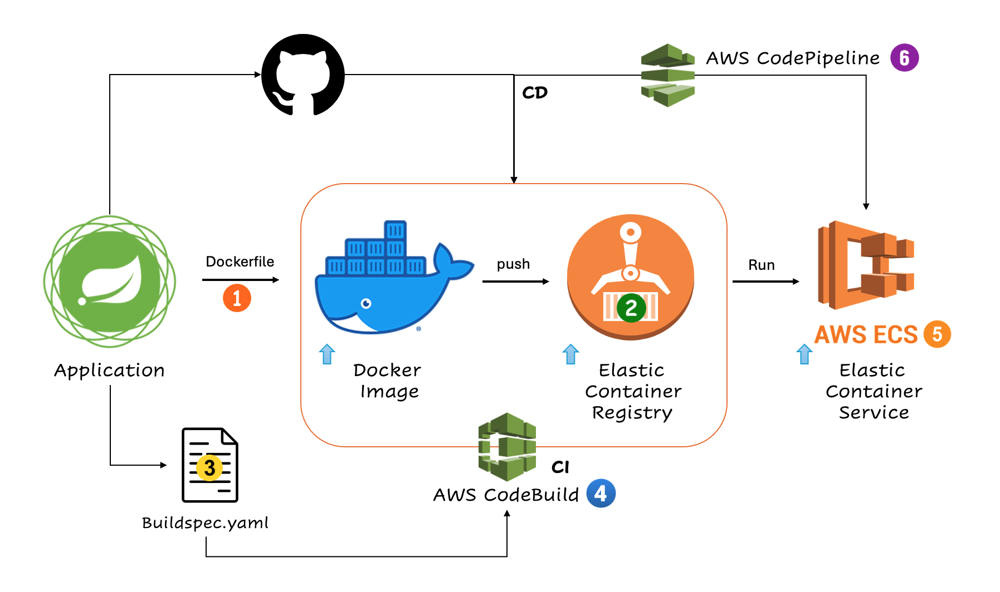
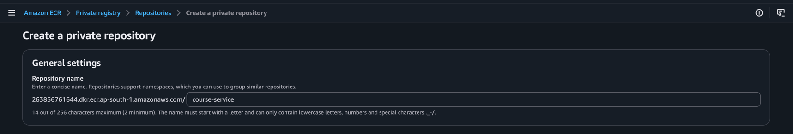

# Complete AWS CI/CD Setup for Spring Boot + Docker + ECR + ECS + CodeBuild + CodePipeline 🚀

## Project Overview

This project demonstrates complete CI/CD pipeline automation using:

- Spring Boot
- Docker
- GitHub
- Amazon ECR
- Amazon ECS
- AWS CodeBuild
- AWS CodePipeline


---

# CI/CD Flow

```text
GitHub Push
      ↓
AWS CodePipeline Trigger
      ↓
AWS CodeBuild Build Process
      ↓
Docker Image Build
      ↓
Push Docker Image to ECR
      ↓
Deploy to ECS
```

---

# Project Structure

```text
course-service/
│
├── src/
├── pom.xml
├── Dockerfile
├── buildspec.yml
├── .dockerignore
```

---

# STEP 1 — Create Spring Boot Application

Verify application works locally:

```bash
mvn clean package
```

Run application:

```bash
java -jar target/course-service.jar
```

Test:

```text
http://localhost:8085
```

---

# STEP 2 — Create Dockerfile

Create file:

```text
Dockerfile
```

Content:

```dockerfile
FROM openjdk:17

LABEL version="1.0"
LABEL maintainer="prashant"
LABEL description="Course Service"

WORKDIR /app
ADD ./target/course-service.jar course-service.jar
EXPOSE 8085
ENTRYPOINT ["java", "-jar", "course-service.jar"]
CMD ["--server.port=8085"]
```

---

# STEP 3 — Create .dockerignore

Create file:

```text
.dockerignore
```

Content:

```text
.git
.idea
target/*.original
README.md
```

---

# STEP 4 — Test Docker Locally

Build Docker image:

```bash
docker build -t course-service .
```

Verify image:

```bash
docker images
```

Run container:

```bash
docker run -p 8085:8085 course-service
```

Access application:

```text
http://localhost:8085
```

---

# STEP 5 — Push Code to GitHub

```bash
git init
git add .
git commit -m "Initial Commit"
git branch -M main
git remote add origin <github_repo_url>
git push -u origin main
```

---

# STEP 6 — Create ECR Repository

AWS Console:

```text
Amazon ECR → Create Repository
```

Repository Name:

```text
course-service
```

Example URI:

```text
123456789012.dkr.ecr.ap-south-1.amazonaws.com/course-service
```



---

# STEP 7 — Create ECS Cluster

AWS Console:

```text
Amazon ECS → Clusters → Create Cluster
```

Settings:

```text
Cluster Name: course-cluster
Launch Type : Fargate
```

---

# STEP 8 — Create Task Definition

AWS Console:

```text
ECS → Task Definitions → Create
```

Settings:

```text
Task Definition Name : course-task
Launch Type          : Fargate
Container Name       : course-service
Port                 : 8085
CPU                  : 256
Memory               : 512
```

Image URI:

```text
<ECR_REPOSITORY_URI>
```

---

# STEP 9 — Create ECS Service

Inside ECS Cluster:

```text
Create Service
```

Settings:

```text
Launch Type : Fargate
Desired Task: 1
```

Networking:

- Public subnet
- Auto assign public IP = ENABLED

Security Group Inbound Rule:

```text
Custom TCP : 8085
Source     : 0.0.0.0/0
```

---

# STEP 10 — Create buildspec.yml

Create file:

```text
buildspec.yml
```

Content:

```yaml
version: 0.2

phases:

  pre_build:
    commands:
      - echo Logging in to Amazon ECR...
      - aws --version

      - ACCOUNT_ID=$(aws sts get-caller-identity --query Account --output text)

      - REGION=ap-south-1

      - REPOSITORY_URI=$ACCOUNT_ID.dkr.ecr.$REGION.amazonaws.com/course-service

      - IMAGE_TAG=latest

      - aws ecr get-login-password --region $REGION | docker login --username AWS --password-stdin $REPOSITORY_URI

  build:
    commands:
      - echo Build started on `date`

      - mvn clean package -DskipTests

      - docker build -t course-service .

      - docker tag course-service:latest $REPOSITORY_URI:$IMAGE_TAG

  post_build:
    commands:
      - echo Build completed on `date`

      - docker push $REPOSITORY_URI:$IMAGE_TAG

      - printf '[{"name":"course-service","imageUri":"%s"}]' $REPOSITORY_URI:$IMAGE_TAG > imagedefinitions.json

artifacts:
  files:
    - imagedefinitions.json
```

---

# STEP 11 — Create CodeBuild Project

AWS Console:

```text
AWS CodeBuild → Create Build Project
```

Source:

```text
GitHub
```

Environment:

```text
Managed Image
Ubuntu
Standard Runtime
```

IMPORTANT:

```text
Enable Privileged Mode
```

Buildspec:

```text
Use buildspec.yml from source code
```

---

# STEP 12 — Add IAM Permissions to CodeBuild Role

Add these policies:

```text
AmazonEC2ContainerRegistryPowerUser
AmazonECS_FullAccess
AmazonS3FullAccess
CloudWatchLogsFullAccess
```

---

# STEP 13 — Create CodePipeline

AWS Console:

```text
AWS CodePipeline → Create Pipeline
```

Stages:

## Source Stage

```text
Provider: GitHub
```

## Build Stage

```text
Provider: AWS CodeBuild
```

## Deploy Stage

```text
Provider: Amazon ECS
```

Select:

```text
Cluster : course-cluster
Service : ECS Service Name
```

IMPORTANT:

Container name MUST match:

```text
course-service
```

---

# STEP 14 — Trigger Pipeline

Push changes:

```bash
git add .
git commit -m "new changes"
git push
```

Pipeline automatically:

- Pulls source code
- Builds Maven project
- Builds Docker image
- Pushes image to ECR
- Deploys latest image to ECS

---

# STEP 15 — Access Application

Go to:

```text
ECS → Tasks
```

Copy Public IP.

Open:

```text
http://<public-ip>:8085
```

---

# Common Issues

## Docker Build Fails

Cause:

```text
Privileged Mode disabled
```

Fix:

Enable privileged mode in CodeBuild.

---

## ECS Deployment Fails

Cause:

```text
Wrong container name
```

Fix:

Container name must match imagedefinitions.json.

---

## Application Not Accessible

Cause:

- Security group missing
- Wrong port
- Public IP disabled

---

## ECR Push Fails

Cause:

```text
Missing IAM permissions
```

Fix:

Add ECR permissions to CodeBuild role.

---

# Recommended Next Learning

- ECS + Load Balancer
- Auto Scaling
- Secrets Manager
- CloudWatch Logs
- Terraform
- Blue/Green Deployment
- Kubernetes (EKS)

